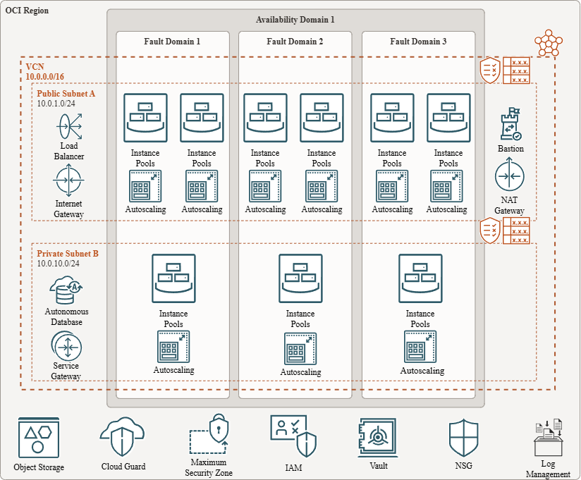

# 01 - Data Analytics Platform Launch 🚀

## Table of Contents
- [Scenario 🚀](#scenario)
- [Initial Questions ❓](#initial-questions)
- [Thoughts & Considerations 💡](#thoughts--considerations)
  - [Speed to Market ⏩](#speed-to-market)
  - [Cost Control 💰](#cost-control)
  - [Minimal DevOps Experience 👷‍♂️](#minimal-devops-experience)
  - [Security 🔒](#security)
  - [Scalability & High Availability 📈](#scalability--high-availability)
  - [Risks & Mitigations ⚠️](#risks--mitigations)
- [Solution Design 🏗️](#solution-design)
  - [Design Rationale 🧠](#design-rationale)
- [Summary ✅](#summary)
- [Additional Notes 📝](#additional-notes)
  - [Network Design 🌐](#network-design)
  - [DNS and Endpoint Access 🛰️](#dns-and-endpoint-access)
  - [Data Governance and Compliance 📊](#data-governance-and-compliance)
  - [Automation and CI/CD 🤖](#automation-and-cicd)
  - [Monitoring and Logging 📡](#monitoring-and-logging)
  - [Backup and Disaster Recovery 💾](#backup-and-disaster-recovery)
  - [Scaling Specifics 🔧](#scaling-specifics)
  - [Serverless Limits and Tradeoffs ⚖️](#serverless-limits-and-tradeoffs)

---

## Scenario  
Design a cost-effective, scalable OCI infrastructure for a startup with minimal DevOps experience, a $10K/month budget, and a 90-day timeline to launch a data analytics platform. The focus is on balancing speed to market, cost control, and high availability.

---

## Initial Questions  
- Why was OCI chosen over AWS, Azure, or GCP?  
- What types of data are being collected and analyzed?  
- Does the team have experience with infrastructure-as-code (IaC) or CI/CD pipelines?  
- Can serverless or managed services be leveraged to simplify operations?  
- What risks arise from a rapid launch and limited technical expertise?

---

## Thoughts & Considerations

### Speed to Market  
- Design a simple, fast-to-deploy architecture.  
- Leverage **OCI Resource Manager (Terraform)** for repeatable, automated provisioning.

### Cost Control  
- Use **OCI Cost Analysis**, **Budgets**, and **Compartment Quotas** to stay within the $10K/month budget.

### Minimal DevOps Experience  
- Avoid complex architectures. Favor managed services like **Autonomous Database**, **Object Storage**, and **Oracle Functions** (serverless).  
- Full Terraform adoption may not be realistic for MVP. Suggest using **OCI Resource Manager's "Export to Terraform"** feature post-deployment to gradually introduce infrastructure-as-code workflows.

### Security  
- Utilize OCI’s **encryption at rest and in transit** capabilities.  
- Use **OCI Vault** for secure key management.

### Scalability & High Availability  
- Use **two instance pools per fault domain** for redundancy.  
- Configure **auto-scaling on each instance pool** based on client-defined thresholds (CPU, memory, custom metrics).  
- Place resources across **Fault Domains** and **Availability Domains** for resilience.  
- Use **load balancers** to distribute traffic and support failover.

### Risks & Mitigations  

| Risk                 | Impact                       | OCI Mitigation                                    |
|----------------------|------------------------------|--------------------------------------------------|
| Limited DevOps skills | System instability            | Use serverless, managed services                  |
| Budget overruns       | Project delay or stall        | Enforce budgets, cost tracking, and compartment quotas |
| Scaling challenges   | Performance degradation       | Plan auto-scaling thresholds and set alerts      |
| Data loss/corruption  | Legal and operational impact  | Redundancy, Object Storage versioning             |

---

## Solution Design

  

### Design Rationale  
- Simple, modular architecture that supports quick deployment and easy management.  
- Serverless components reduce operational overhead.  
- Cost controls embedded in environment separation and budgeting.

---

## Summary

Given the client’s need to launch quickly, with limited DevOps experience and a fixed $10K/month budget, OCI’s serverless analytics stack — using Autonomous Data Warehouse, Object Storage, and Oracle Analytics Cloud — offers an optimal balance of scalability, security, and simplicity.

Leveraging OCI Vault for key management, IAM and compartments for access control, and Cloud Guard for monitoring ensures compliance without added complexity.

Compared to AWS or Azure, OCI provides lower storage and egress costs and native integration with Oracle DB and analytics services — enabling faster time to insight while staying within budget.

---

## Additional Notes

### Network Design  
- VCN includes segmented **public and private subnets**.  
- **NAT Gateway** is correctly deployed in the **public subnet** to allow outbound internet access from compute instances in private subnets.  
- Routing, NSGs, and security lists enforce least-privilege access between services.

### DNS and Endpoint Access  
- A **public DNS zone** is managed using **OCI DNS (Edge Services)** to expose APIs and dashboards under branded domains.  
- Private subnets leverage **VCN-native DNS resolvers** (.2 IP address per subnet) for internal service discovery.  
- Future iterations can incorporate **custom private DNS zones** for microservice naming.

### Data Governance and Compliance  
- **OCI Vault** manages encryption keys; encryption is enforced at rest and in transit by default.  
- **IAM policies** are scoped by compartment to enforce least privilege.  
- **Cloud Guard** monitors for misconfigurations or threats.  
- **Audit Logs** record all control plane activity.  
- Compliance frameworks can be addressed later via tagging, classification, and data retention policies.

### Automation and CI/CD  
- CI/CD pipelines are deferred for MVP due to limited DevOps skillset.  
- Initial deployments use **OCI Resource Manager UI** for ease of use.  
- Infrastructure can be **exported to Terraform** post-deployment for future automation maturity.  
- Long term, introduce pipelines via **OCI DevOps**, **GitHub Actions**, or other tools.

### Monitoring and Logging  
- **OCI Logging** aggregates service and system logs for review and alerting.  
- **OCI Monitoring** tracks key performance metrics (CPU, memory, etc.).  
- **Alarms and notifications** can be configured to alert based on thresholds.  
- **Service Connector Hub** supports log export to Object Storage, Streaming, or third-party SIEMs.

### Backup and Disaster Recovery  
- **Autonomous Database** handles automated daily backups (up to 60-day retention).  
- **Object Storage lifecycle policies** move data to Archive Storage for long-term retention.  
- **Versioning** on Object Storage buckets prevents data loss from overwrites or deletions.  
- Future phases should explore **cross-region DR** and backup automation.

### Scaling Specifics  
- The architecture uses **two instance pools per fault domain** for high availability.  
- Each instance pool is configured with **autoscaling rules** (based on CPU, memory, etc.) tailored to client usage patterns.  
- Load balancers distribute traffic across all healthy instances, improving reliability and responsiveness.

### Serverless Limits and Tradeoffs  

#### Benefits  
- Reduces operational burden; no need to manage compute resources.  
- Scales automatically based on workload.  
- Usage-based pricing aligns with budget-conscious environments.

#### Trade-offs  
- **Cold start latency** can impact response times for infrequent workloads.  
- **Execution limits** for Oracle Functions (e.g., 300s timeout, memory limits).  
- Less control over environment and scaling granularity.  
- Potential **vendor lock-in** when deeply integrated with OCI-specific tooling.  

Recommendation: Use serverless for **event-driven workloads, ETL triggers, and API backends**. For long-running or stateful workloads, explore **Container Engine for Kubernetes (OKE)** or **Compute instances**.

