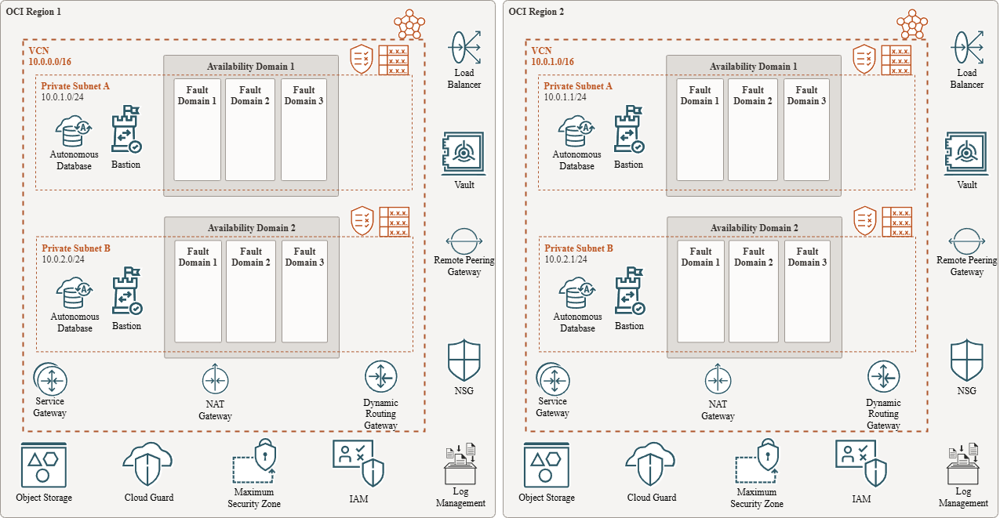

# 02 - HIPAA & GxP-Compliant Data Lake 🧪

## Table of Contents
- [Scenario 🚀](#scenario)
- [Initial Questions ❓](#initial-questions)
- [Thoughts & Considerations 💡](#thoughts--considerations)
  - [Regulatory Compliance 🔐](#regulatory-compliance)
  - [Architecture Principles 🛠️](#architecture-principles)
    - [Security-First Design ✅](#security-first-design)
    - [Interoperability 🧩](#interoperability)
  - [Identity & Conditional Access Control 🔐](#identity--conditional-access-control)
  - [Infrastructure Automation & Compliance 🧾](#infrastructure-automation--compliance)
- [Solution Design 🏗️](#solution-design)
  - [Design Rationale 🧠](#design-rationale)
- [Summary ✅](#summary)
- [Additional Notes 📝](#additional-notes)
  - [Monitoring & Governance 🛡️](#monitoring--governance)
  - [Storage & Retention 🗃️](#storage--retention)
  - [Network & Security Design 🌐](#network--security-design)
  - [Risk Mitigation Table 🚨](#risk-mitigation-table)
  - [Why Choose OCI? 📌](#why-choose-oci)

---

## Scenario  
Design a cost-effective, scalable OCI infrastructure for a startup with minimal DevOps experience, a $10K/month budget, and a 90-day timeline to launch a data analytics platform. The focus is on balancing speed to market, cost control, and high availability.

---

## Initial Questions

- What business outcomes is the client targeting with this data lake?
- What types of data will be stored?
- What compliance standards must be met?
- Do internal teams have prior experience with cloud-native security tools?
- Can native OCI services meet auditability requirements without third-party tools?
- What tools does the client use to manage training and access requests?

---

## Thoughts & Considerations

### Regulatory Compliance  
| Standard           | Key Requirements                                                | OCI Solution                            |
|--------------------|----------------------------------------------------------------|----------------------------------------|
| **HIPAA**          | Encryption, access control, auditability, breach monitoring    | OCI Vault, IAM, Audit Logs, Cloud Guard |
| **21 CFR Part 11**  | Training verification, audit trails, electronic records        | IAM integration, Audit, Resource Manager |
| **Annex 11**       | System validation, change control, access tracking              | Compartments, IAM, Logging             |

### Architecture Principles

#### Security-First Design  
- Enforce **least privilege** using **OCI IAM**, compartments, dynamic groups  
- **Federate OCI IAM with Active Directory** for unified identity management  
- Require **training validation before access provisioning** (most pharmaceutical companies have this by default)  
- Use **OCI Vault** for encryption keys (encryption at rest + in transit)  
- **Cloud Guard** for posture management and automated remediation  
- Enable **Audit Logs** for traceability and compliance

#### Interoperability  
- Ingest data from Oracle DB, CSVs, LIMS, EHRs, clinical partners (CROs)  
- Use OCI Data Integration for batch ETL pipelines, Streaming for real-time data ingestion, Object Storage as the data lake layer, and Autonomous Data Warehouse (ADW) for structured querying and compliance reporting  
- Keep analytics and data lake co-located in OCI to avoid egress costs  

### Identity & Conditional Access Control
- Enforce **policy-based conditional access** (e.g., grant access only after training completion via AD group membership)  
- Supports **21 CFR Part 11** and **Annex 11** personnel qualification requirements

### Infrastructure Automation & Compliance

- **Use [Terraform](https://www.terraform.io/)** for Infrastructure as Code (IaC) to enable:  
  - Version-controlled, repeatable OCI deployments  
  - Audit trails essential for **pharma change control** and **GxP traceability**  
  - Seamless integration into CI/CD and approval workflows  

- **Use [Ansible](https://www.ansible.com/)** for post-provisioning configuration to:  
  - Ensure consistent, validated system states across compute resources  
  - Deploy security agents, monitoring tools, and baseline hardening policies  
  - Align with **Annex 11** and **21 CFR Part 11** expectations for configuration control  

---

## Solution Design

### Design Rationale

- Simple, modular architecture that aligns with **HIPAA** and **GxP** controls  
- Native **OCI services** reduce complexity and lower compliance overhead  
- **Infrastructure as Code (Terraform)** and **Configuration Automation (Ansible)** ensure reproducibility and auditability  
- Prioritizes **traceability**, **least privilege**, and **change control** for regulated workloads  

---

## Summary

OCI provides a **simple and compliant platform** for building HIPAA- and GxP-aligned data lakes — especially for pharmaceutical clients already aligned with Oracle technologies.

By leveraging native services:

- ✅ **OCI Vault** for secure encryption  
- ✅ **IAM + Active Directory federation** for identity and conditional access control  
- ✅ **Cloud Guard + Audit Logs** for real-time visibility and audit trail generation  

This avoids overengineering and lays the groundwork for future growth in **analytics**, **AI/ML**, and **automated compliance reporting**.

---

## Additional Notes

### Monitoring & Governance

| Capability               | Description                                                     |
|--------------------------|-----------------------------------------------------------------|
| **Cloud Guard**          | Detects misconfigurations, enables auto-remediation             |
| **Audit Logs**           | Captures all API/console activity for compliance traceability   |
| **Service Connector Hub**| Routes logs to **Object Storage**, **Streaming**, or external **SIEMs** |
| **Monitoring + Alarms**  | Alerts on anomalies (e.g., Vault changes, traffic spikes, IAM changes) |

### Storage & Retention

| Feature                    | Purpose                                                          |
|----------------------------|------------------------------------------------------------------|
| **Object Storage**         | Serves as the primary data lake for raw and processed datasets   |
| **Versioning**             | Tracks changes, prevents data loss from accidental overwrites/deletions |
| **Lifecycle Rules**        | Automatically moves aged data to **Archive Storage** for cost savings |
| **Cross-Region Replication**| Ensures regulatory durability and geographic redundancy (optional) |

### Network & Security Design

| Component                | Purpose                                                          |
|--------------------------|------------------------------------------------------------------|
| **VCN**                  | Private subnets isolate sensitive workloads                      |
| **Service Gateway**      | Enables secure, private access to **Object Storage** and other OCI services |
| **NAT Gateway**          | Controlled outbound internet access from private subnets         |
| **Security Lists & NSGs**| Enforce **least-privilege** communication between services       |

### Risk Mitigation Table

| Risk                        | Impact                          | Mitigation Strategy                                   |
|-----------------------------|--------------------------------|------------------------------------------------------|
| Misconfigured access        | Unauthorized data exposure      | IAM policies + AD federation + Cloud Guard           |
| Unencrypted data            | HIPAA violation                 | **Vault-managed encryption** at rest and in transit  |
| Inadequate audit trails     | Regulatory non-compliance       | Enable **Audit Logs**, export to secure, immutable storage |
| Overengineering/complexity  | Project delays or cost overruns | Start with **native OCI tools**, defer external SIEM/SOAR |
| Unqualified personnel       | GxP violation                   | Enforce training completion before access (via AD workflows) |

---

### Why Choose OCI?

- ✅ Lower **egress and storage costs** compared to AWS and Azure  
- ✅ Seamless **Oracle DB and analytics stack integration**  
- ✅ Built-in **compliance controls** for HIPAA, GxP, 21 CFR Part 11  
- ✅ Enterprise support tailored for **regulated industries**  
