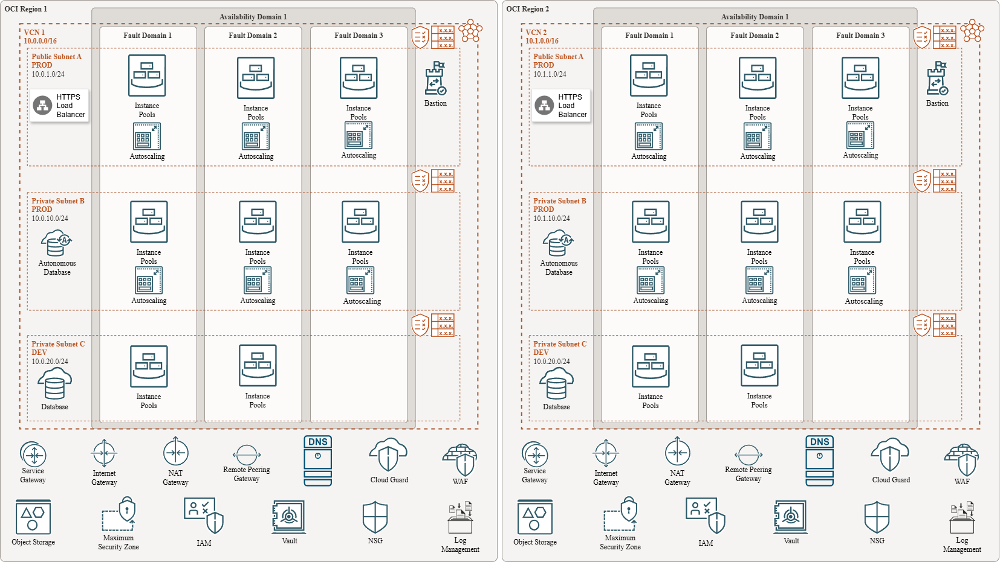

# 03 - Multi-Region High Availability Setup 🗺️

## Table of Contents
- [Scenario 🚀](#scenario)
- [Initial Questions ❓](#initial-questions)
- [Thoughts & Considerations 💡](#thoughts--considerations)
  - [Business Continuity Planning 📊](#business-continuity-planning)
  - [Active-Active vs Active-Passive ⚖️](#active-active-vs-active-passive)
- [Solution Design 📐](#solution-design)
- [Summary 🧾](#summary)
- [Additional Notes 📝](#additional-notes)
  - [Networking & Inter-Region Connectivity 🌐](#networking--inter-region-connectivity)
  - [Infrastructure Setup Overview 🏗️](#infrastructure-setup-overview)
  - [Monitoring & Governance 🔍](#monitoring--governance)
  - [Networking & Security Design 🔐](#networking--security-design)

---

## Scenario

Design a multi-region, highly available architecture for an ecommerce platform on OCI. Utilize availability domains, load balancing, object storage, and auto-scaling to meet business continuity goals, while weighing active-active versus active-passive configurations.

---

## Initial Questions

- What architecture would I propose using OCI Load Balancer, Regions, and Object Storage for multi-region ecommerce high availability?  
- How do I weigh the cost/benefits of active-active versus active-passive designs?  
- How do I align RTO/RPO expectations with business goals?  
- What components should be shared across environments, and which should be isolated (e.g., prod vs dev)?  
- What security and scaling mechanisms are needed for regulated ecommerce workloads?

---

## Thoughts & Considerations

### Business Continuity Planning

- **RTO (Recovery Time Objective)**: The time to recover after a failure.
- **RPO (Recovery Point Objective)**: The amount of acceptable data loss.
- This design targets **RTO < 5 minutes** and **RPO < 1 minute** using regional failover and Autonomous Database cross-region replication.

### Active-Active vs Active-Passive

| Mode             | Pros                                           | Cons                                        |
|------------------|------------------------------------------------|---------------------------------------------|
| Active-Active     | Lower RTO/RPO, real-time failover              | More complex routing, higher cost           |
| Active-Passive    | Simpler, more cost-effective                   | Longer RTO/RPO, potential cold start delays |

**Chosen Approach**: Active-Passive to balance cost with sufficient resilience.

---

## Solution Design

### Design Rationale
This architecture supports a regulated ecommerce workload requiring high availability, scalability, and compliance. A cost-efficient **Active-Passive** model was chosen over Active-Active to reduce operational complexity and manage expenses while meeting RTO/RPO goals. Separate regions and fault domains enhance fault tolerance and disaster recovery. Security, monitoring, and governance are integrated into every layer using OCI native services.

---

## Summary

This multi-region architecture supports **high availability**, **regulatory compliance**, and **scalable performance** for an ecommerce workload. Active-passive deployment minimizes cost while still meeting strict RTO/RPO goals. WAF, Vault, IAM, and Cloud Guard enforce layered security controls, and remote peering ensures efficient regional connectivity and failover readiness.

---
## Additional Notes

### Networking & Inter-Region Connectivity

- VCNs in each region use **non-overlapping CIDRs**
- **Remote Peering Gateways (RPG)** enable secure region-to-region traffic
- **Service Gateway (SG)** allows private access to Object Storage, Monitoring, and Autonomous DB
- Each VCN includes:
  - **Internet Gateway (IG)** for public egress/ingress
  - **NAT Gateway (NG)** for secure outbound traffic from private subnets
  - Optional **Dynamic Routing Gateway (DRG)** for future hybrid networking

### Infrastructure Setup Overview

- Separate **DEV** and **PROD** environments at the **subnet level per region**
- Compute workloads deployed in **Instance Pools** across all **3 Fault Domains**
- **Auto-scaling**, **WAF**, and **HTTPS Load Balancers** ensure performance and resilience
- **Autonomous Database** replicated across regions via **Data Guard** or **Autonomous DB cross-region replication**

### Monitoring & Governance

- **OCI Monitoring** and **Alarms** configured for critical components (e.g., Load Balancer, DB health)
- **Cloud Guard** + **Max Security Zones** enabled in each region for continuous compliance
- **Audit logs** stored in Object Storage and **replicated between regions** for availability

### Networking & Security Design

- All VCNs follow **zero trust principles**:
  - Restricted ingress/egress via **Security Lists** or **Network Security Groups (NSGs)**
- **Vault** used for secure **key management** and encryption policies
- **HTTPS Load Balancer** in public subnet routes traffic to private compute instances
- Backend communication secured through **remote peering**, reducing latency and exposure

